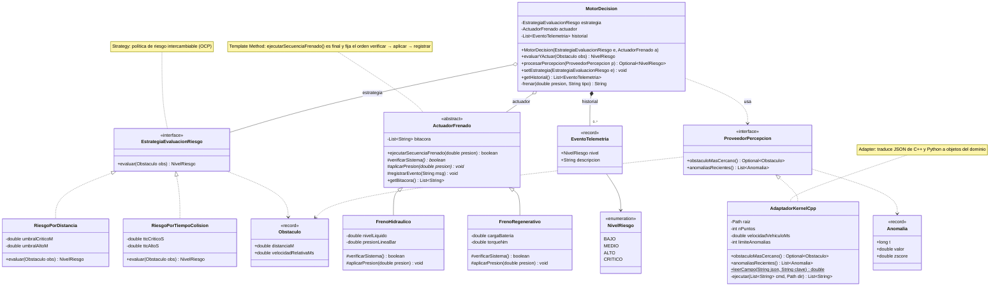

```mermaid
classDiagram
direction TB

class NivelRiesgo {
  <<enumeration>>
  BAJO
  MEDIO
  ALTO
  CRITICO
}

class Obstaculo {
  <<record>>
  +double distanciaM
  +double velocidadRelativaMs
}

class Anomalia {
  <<record>>
  +long t
  +double valor
  +double zscore
}

class EventoTelemetria {
  <<record>>
  +NivelRiesgo nivel
  +String descripcion
}

class EstrategiaEvaluacionRiesgo {
  <<interface>>
  +evaluar(Obstaculo obs) NivelRiesgo
}

class RiesgoPorDistancia {
  -double umbralCriticoM
  -double umbralAltoM
  +evaluar(Obstaculo obs) NivelRiesgo
}

class RiesgoPorTiempoColision {
  -double ttcCriticoS
  -double ttcAltoS
  +evaluar(Obstaculo obs) NivelRiesgo
}

class ActuadorFrenado {
  <<abstract>>
  -List~String~ bitacora
  +ejecutarSecuenciaFrenado(double presion) boolean
  #verificarSistema()* boolean
  #aplicarPresion(double presion)* void
  #registrarEvento(String msg) void
  +getBitacora() List~String~
}

class FrenoHidraulico {
  -double nivelLiquido
  -double presionLineaBar
  #verificarSistema() boolean
  #aplicarPresion(double presion) void
}

class FrenoRegenerativo {
  -double cargaBateria
  -double torqueNm
  #verificarSistema() boolean
  #aplicarPresion(double presion) void
}

class ProveedorPercepcion {
  <<interface>>
  +obstaculoMasCercano() Optional~Obstaculo~
  +anomaliasRecientes() List~Anomalia~
}

class AdaptadorKernelCpp {
  -Path raiz
  -int nPuntos
  -double velocidadVehiculoMs
  -int limiteAnomalias
  +obstaculoMasCercano() Optional~Obstaculo~
  +anomaliasRecientes() List~Anomalia~
  +leerCampo(String json, String clave)$ double
  -ejecutar(List~String~ cmd, Path dir) List~String~
}

class MotorDecision {
  -EstrategiaEvaluacionRiesgo estrategia
  -ActuadorFrenado actuador
  -List~EventoTelemetria~ historial
  +MotorDecision(EstrategiaEvaluacionRiesgo e, ActuadorFrenado a)
  +evaluarYActuar(Obstaculo obs) NivelRiesgo
  +procesarPercepcion(ProveedorPercepcion p) Optional~NivelRiesgo~
  +setEstrategia(EstrategiaEvaluacionRiesgo e) void
  +getHistorial() List~EventoTelemetria~
  -frenar(double presion, String tipo) String
}

EstrategiaEvaluacionRiesgo <|.. RiesgoPorDistancia
EstrategiaEvaluacionRiesgo <|.. RiesgoPorTiempoColision
ActuadorFrenado <|-- FrenoHidraulico
ActuadorFrenado <|-- FrenoRegenerativo
ProveedorPercepcion <|.. AdaptadorKernelCpp

MotorDecision o-- EstrategiaEvaluacionRiesgo : estrategia
MotorDecision o-- ActuadorFrenado : actuador
MotorDecision *-- "0..*" EventoTelemetria : historial
MotorDecision ..> ProveedorPercepcion : usa
EstrategiaEvaluacionRiesgo ..> Obstaculo
ProveedorPercepcion ..> Obstaculo
ProveedorPercepcion ..> Anomalia
EventoTelemetria --> NivelRiesgo

note for ActuadorFrenado "Template Method: ejecutarSecuenciaFrenado() es final y fija el orden verificar → aplicar → registrar"
note for EstrategiaEvaluacionRiesgo "Strategy: política de riesgo intercambiable (OCP)"
note for AdaptadorKernelCpp "Adapter: traduce JSON de C++ y Python a objetos del dominio"
```
